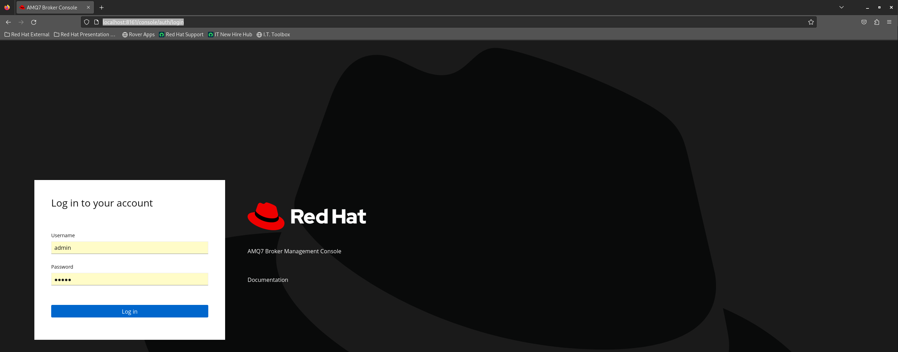
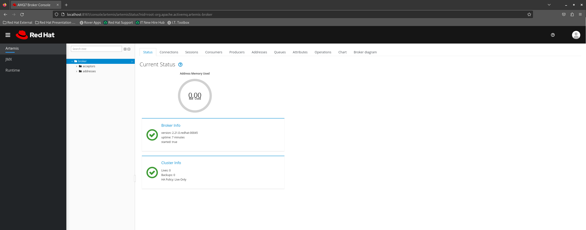
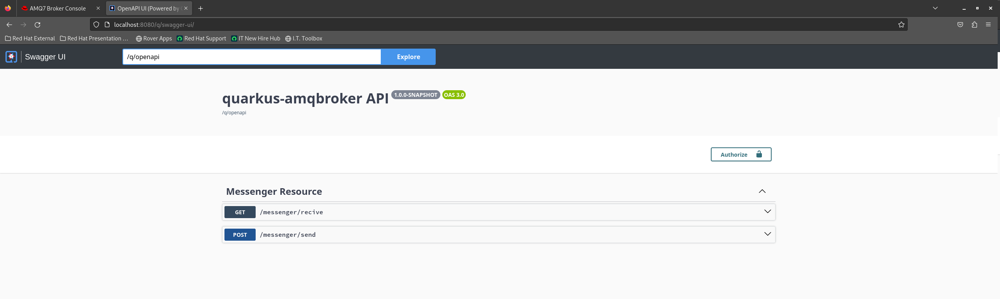
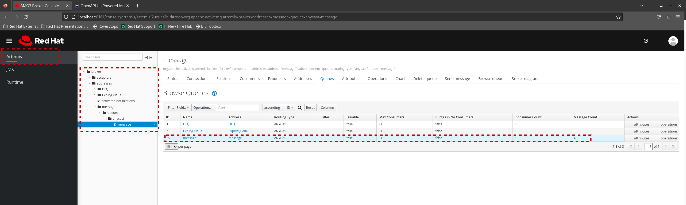

# A Guide to Creating and Consuming JMS Queues with Quarkus and AQM-Broker
This insightful tutorial provides step-by-step guidance on initializing the Red Hat AQM-Broker, complemented by a comprehensive Quarkus source code demonstration. Learn the essentials of creating and efficiently consuming a JMS Queue with ease. #quarkus-amqbroker

# Requeriments
* OpenJDK 17
* Apache Maven 3.8.6
* podman 4.5.1
* Red Hat AMQ Broker Image, version 7.10 


# Sumary


## Downloading Image and Initiating Container: Streamlining the Process for Seamless Deployment
The initial step involves logging in to the Red Hat Registry. If you don't have access to the Red Hat Registry, you have the option to use a community image. Following this, execute the subsequent steps: pull the image and initiate it in the foreground. 

1. Log in to the Red Hat Registry.
```bash
podman login -u <your_user> registry.redhat.io
```
```console
Login Succeeded!
```

2. Pulling the container image to localhost.
```bash
podman pull registry.redhat.io/amq7/amq-broker-rhel8:7.10.4
```
```console
Trying to pull registry.redhat.io/amq7/amq-broker-rhel8:7.10.4...
Getting image source signatures
Checking if image destination supports signatures
Copying blob d65979adae7a skipped: already exists  
Copying blob 44b6ad158ea3 skipped: already exists  
Copying blob c4024a5c52fc skipped: already exists  
Copying blob 395bceae1ad3 skipped: already exists  
Copying config 2900fc79c4 done   | 
Writing manifest to image destination
Storing signatures
2900fc79c491b2d800fda5ed27a939d2b1a8cd705005829b823fc904d8f9e420
```

3. Initiating the AQM Broker container while exposing ports.
```bash
podman run -d --name amq-broker -e AMQ_USER=admin -e AMQ_PASSWORD=admin -p 8161:8161 -p 5672:5672 registry.redhat.io/amq7/amq-broker-rhel8:7.10.4
```
```console
293c4a913f1ec19f65631821d5adbe54adc1a84224d76c9214c91e142463ffc6
```

4. Verifying the execution of the container
```bash
podman ps
```
```console
CONTAINER ID  IMAGE                                            COMMAND               CREATED             STATUS             PORTS                                           NAMES
293c4a913f1e  registry.redhat.io/amq7/amq-broker-rhel8:7.10.4  /opt/amq/bin/laun...  About a minute ago  Up About a minute  0.0.0.0:5672->5672/tcp, 0.0.0.0:8161->8161/tcp  amq-broker
```
Explore the AQM Broker by accessing it through your web browser. Utilize the credentials "admin" for the username and "admin" as the password, as specified in the parameters of the Podman command.






## Running Quarkus Application in Development Mode: Streamlining the Development Workflow
Before launching the Quarkus application, ensure that all requirements are met. I personally use Linux Bash for execution, but feel free to use an IDE or any other preferred method according to your convenience.
```bash
mvn clean compile quarkus:dev
```
```console
INFO] Scanning for projects...
[INFO] 
[INFO] ---------------------< org.acme:quarkus-amqbroker >---------------------
[INFO] Building quarkus-amqbroker 1.0.0-SNAPSHOT
[INFO] --------------------------------[ jar ]---------------------------------
[INFO] 
[INFO] --- maven-clean-plugin:2.5:clean (default-clean) @ quarkus-amqbroker ---
[INFO] Deleting /home/parraes/quarkus-amqbroker/target
[INFO] 
[INFO] --- maven-resources-plugin:2.6:resources (default-resources) @ quarkus-amqbroker ---
[INFO] Using 'UTF-8' encoding to copy filtered resources.
[INFO] Copying 2 resources
[INFO] 
[INFO] --- quarkus-maven-plugin:3.4.3:generate-code (default) @ quarkus-amqbroker ---
[INFO] 
[INFO] --- maven-compiler-plugin:3.11.0:compile (default-compile) @ quarkus-amqbroker ---
[INFO] Changes detected - recompiling the module! :source
[INFO] Compiling 3 source files with javac [debug release 17] to target/classes
[INFO] 
[INFO] --- quarkus-maven-plugin:3.4.3:dev (default-cli) @ quarkus-amqbroker ---
[INFO] Invoking resources:2.6:testResources (default-testResources) @ quarkus-amqbroker
[INFO] Using 'UTF-8' encoding to copy filtered resources.
[INFO] skip non existing resourceDirectory /home/parraes/quarkus-amqbroker/src/test/resources
[INFO] Invoking quarkus:3.4.3:generate-code-tests (default) @ quarkus-amqbroker
[INFO] Invoking compiler:3.11.0:testCompile (default-testCompile) @ quarkus-amqbroker
[INFO] No sources to compile
Listening for transport dt_socket at address: 5005


__  ____  __  _____   ___  __ ____  ______ 
 --/ __ \/ / / / _ | / _ \/ //_/ / / / __/ 
 -/ /_/ / /_/ / __ |/ , _/ ,< / /_/ /\ \   
--\___\_\____/_/ |_/_/|_/_/|_|\____/___/   
2023-11-10 11:27:29,949 ERROR [io.qua.run.Application] (Quarkus Main Thread) Port 8080 seems to be in use by another process. Quarkus may already be running or the port is used by another application.

2023-11-10 11:27:29,954 WARN  [io.qua.run.Application] (Quarkus Main Thread) Use 'netstat -anop | grep 8080' to identify the process occupying the port.
2023-11-10 11:27:29,954 WARN  [io.qua.run.Application] (Quarkus Main Thread) You can try to kill it with 'kill -9 <pid>'.

--
Tests paused
Press [space] to restart, [e] to edit command line args (currently ''), [r] to resume testing, [o] Toggle test output, [:] for the terminal, [h] for more options>
```

### Testing Your Application
In this session, we will test the APIs using curl. Alternatively, you can utilize the Swagger web console by accessing http://localhost:8080/q/swagger-ui.


1. Message Production: Generating and Sending Messages Effectively
```bash
curl -X 'POST' \
  'http://localhost:8080/messenger/send' \
  -H 'accept: */*' \
  -H 'Content-Type: application/json' \
  -d '"my first messege using JMS on quarkus"'
```

```bash
curl -X 'POST' \
  'http://localhost:8080/messenger/send' \
  -H 'accept: */*' \
  -H 'Content-Type: application/json' \
  -d '"my second messege using JMS on quarkus"'
```

```bash
curl -X 'POST' \
  'http://localhost:8080/messenger/send' \
  -H 'accept: */*' \
  -H 'Content-Type: application/json' \
  -d '"Is it so fun?"'
```

Navigation of the AMQ Broker Console: Locating Your Queue with Ease


2. Message Consuming: Efficiently Receiving and Processing Messages
```bash
curl -X 'GET' \
  'http://localhost:8080/messenger/recive' \
  -H 'accept: application/plain'
```
```console
"my first messege using JMS on quarkus"
```
```bash
curl -X 'GET' \
  'http://localhost:8080/messenger/recive' \
  -H 'accept: application/plain'
```
```console
"my second messege using JMS on quarkus"
```
```bash
curl -X 'GET' \
  'http://localhost:8080/messenger/recive' \
  -H 'accept: application/plain'
```
```console
"Is it so fun?""
```

## Understanding the Source Code:

### application.properties
```property:quarkus.qpid-jms.url
quarkus.qpid-jms.url=amqp://localhost:5672 (1)
```
```property:quarkus.qpid-jms.username (2)
quarkus.qpid-jms.username=admin
```
```property:quarkus.qpid-jms.password (3)
quarkus.qpid-jms.password=admin
```

1. AMQ Broker Address URL: Accessing the Endpoint for Your Messaging Solution;
2. AMQ Broker User;
3. AMQ Broker Password;


### MessengerResource.java
```java
package org.acme;

import jakarta.inject.Inject;
import jakarta.ws.rs.GET;
import jakarta.ws.rs.POST;
import jakarta.ws.rs.Path;
import jakarta.ws.rs.Produces;

@Path("/messenger") (1)
@Produces("application/plain")
public class MessengerResource {

    @Inject
    MessengerProducer messengerProducer;

    @Inject
    MessengerConsumer messengerConsumer;
    
    @POST
    @Path("/send") (2)
    public void send(String sMessage) {
        messengerProducer.send(sMessage);
    }

    @GET
    @Path("/recive") (3)
    public String recive() {
        return messengerConsumer.recive();
    }
}
```
1. API root address;
2. API to send messenge (producer);
3. API to recive messenge (consumer);

### MessengerProducer.java

### MessengerConsumer.java
## Related Guides

- SmallRye OpenAPI ([guide](https://quarkus.io/guides/openapi-swaggerui)): Document your REST APIs with OpenAPI - comes with Swagger UI
- RESTEasy Reactive ([guide](https://quarkus.io/guides/resteasy-reactive)): A Jakarta REST implementation utilizing build time processing and Vert.x. This extension is not compatible with the quarkus-resteasy extension, or any of the extensions that depend on it.
- JAX-RS ([guide])(https://quarkus.io/guides/getting-started-reactive#reactive-jax-rs-resources)
- Camel Simple JMS2 ([guide](https://camel.apache.org/camel-quarkus/latest/reference/extensions/sjms2.html)): Send and receive messages to/from a JMS Queue or Topic using plain JMS 2.x API
